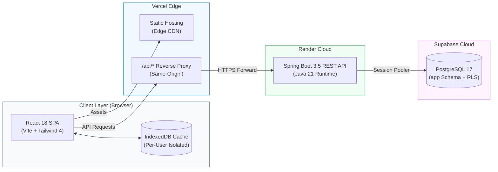

<div align="center">

<!-- LOGO -->


<br/>

### A sharp, high-contrast task management system engineered for focus, speed, and real-world execution.

<br/>

[](https://taskflow-olive-psi.vercel.app/)
[](https://taskflow-api-d6bm.onrender.com/actuator/health/readiness)
[](https://github.com/S-Srinivasan-06/Taskflow/actions/workflows/ci.yml)

<br/>

[](https://openjdk.org/projects/jdk/21/)
[](https://spring.io/projects/spring-boot)
[](https://react.dev/)
[](https://www.typescriptlang.org/)
[](https://tailwindcss.com/)
[](https://www.postgresql.org/)
[](https://www.docker.com/)
[](https://vitejs.dev/)

</div>

> [!NOTE]
> **Live Demo Notice:** The backend runs on Render's free tier and spins down during periods of inactivity. Cold starts can take up to 90–120 seconds. Keep the Taskflow tab open—the frontend automatically pings the backend and transitions once healthy.

---

## Highlights & Features

- ⚡ **High-Contrast Brutalist Aesthetic**: Designed for immediate visual clarity with crisp typography, tailored status badges, zero layout shift, and fluid dark/light theme switching.
- 🕒 **Timezone Intelligence**: Live interactive dual-clock widget supporting local time alongside target world timezones (e.g. UTC, Asia/Kolkata, America/New_York) with real-time offset recalculations for deadlines.
- 📅 **Interactive Calendar & Day Filter**: Visual monthly schedule showing color-coded daily completion markers and instantaneous single-click date-scoped filtering.
- ⌨️ **Keyboard-First Navigation**: Streamlined hotkeys for rapid workflow (`N` or `C` to create a task, `/` to focus search, `Esc` to close modals or reset date filters).
- 💾 **Client-Side Cache Engine**: Opt-in IndexedDB caching layer with per-user tenant isolation, network-first strategy, 24-hour TTL, and automated purge on mutations.
- 🔒 **Defense-in-Depth Security**:
  - Stateful HttpOnly, `SameSite=Lax` session cookies with server-side SHA-256 token hashing.
  - Double-Submit CSRF protection on all mutating endpoints.
  - Dual-window brute-force and credential-stuffing rate limiting (IP and username levels).
  - PostgreSQL Row Level Security (RLS) ensuring strict per-user multi-tenant data boundaries.
- 🚀 **Optimistic UI Updates**: Instant interactive feedback on task status transitions (Todo ➔ In Progress ➔ Done) with version-based conflict detection.

---

## Live Architecture



| Component | Host / Provider | Role | Live Link |
|---|---|---|---|
| **Frontend & API Proxy** | Vercel | React SPA delivery + Same-origin `/api` forwarding | [taskflow-olive-psi.vercel.app](https://taskflow-olive-psi.vercel.app/) |
| **Backend API** | Render | Spring Boot 3.5 REST application | [taskflow-api-d6bm.onrender.com](https://taskflow-api-d6bm.onrender.com/actuator/health/readiness) |
| **Database** | Supabase | Managed PostgreSQL 17 with private `app` schema and RLS | *Private VPC Connection* |

The browser interacts strictly with the Vercel origin. Vercel forwards `/api/*` calls to the Render backend, preserving secure session cookies and CSRF tokens across origins without exposing internal infrastructure credentials.

---

## Visual Showcase

### Dashboard & Task Management

| Main Dashboard (Light Mode) | Quick Create / Edit Modal |
|:---:|:---:|
|  |  |

### Dynamic Calendar & Timezone Widget

| Monthly Calendar & Day Inspector | Dual-Timezone Clock Selector |
|:---:|:---:|
|  |  |

<details>
<summary><b>🌙 Click to view Dark Mode showcase</b></summary>
<br/>

| Dark Mode Dashboard | Dark Mode Filtered View |
|:---:|:---:|
|  |  |

</details>

---

## Tech Stack

| Domain | Technology | Key Capabilities |
|---|---|---|
| **Backend** | Java 21, Spring Boot 3.5 | Spring Security, Spring Data JPA, Hibernate, Jakarta Validation, Actuator |
| **Frontend** | React 18, TypeScript 5, Vite 6 | TanStack Query 5, Tailwind CSS 4, Motion, Lucide Icons, Sonner |
| **Database** | PostgreSQL 17 (Supabase / Local) | Dedicated `app` schema, Row-Level Security (RLS), HikariCP pool |
| **Security** | BCrypt, SHA-256, Double-Submit CSRF | HttpOnly `SameSite=Lax` cookies, sliding-window rate limiters |
| **Storage** | IndexedDB (via `idb-keyval`) | Per-user client cache, network-first, 24h expiration, automatic purge |
| **Testing** | JUnit 5, Mockito, Testcontainers, Vitest | Containerized integration tests, Fake-IndexedDB client testing |
| **DevOps** | Docker, Docker Compose, GitHub Actions | Multi-stage production Dockerfile, automated build and lint CI |

---

## Keyboard Shortcuts

| Shortcut | Action | Scope |
|:---:|---|---|
| <kbd>N</kbd> or <kbd>C</kbd> | Open New Task modal | Global (when not typing in an input) |
| <kbd>/</kbd> | Focus global task search bar | Global |
| <kbd>Esc</kbd> | Close active modal **or** clear active calendar day filter | Global |

---

## API Reference

The backend exposes a secure RESTful API rooted at `/api/v1`. Authenticated endpoints require the `TASKFLOW_SESSION` cookie. State-mutating requests (`POST`, `PUT`, `PATCH`, `DELETE`) require the `X-CSRF-TOKEN` header returned by `/api/v1/auth/csrf`.

### Authentication Endpoints

| Method | Endpoint | Description | Auth Required |
|---|---|---|:---:|
| `POST` | `/api/v1/auth/register` | Register new user account (`userId`, `password`, `confirmPassword`) | ❌ |
| `POST` | `/api/v1/auth/login` | Authenticate and receive HttpOnly session cookie | ❌ |
| `GET` | `/api/v1/auth/csrf` | Fetch CSRF token for mutating requests | ❌ |
| `GET` | `/api/v1/auth/me` | Fetch currently authenticated user details | ✅ |
| `POST` | `/api/v1/auth/logout` | Invalidate and purge active session | ✅ |

### Task Endpoints

| Method | Endpoint | Description | Query Parameters / Payload |
|---|---|---|---|
| `GET` | `/api/v1/tasks` | Get paginated tasks for user | `page=0&size=10&sortBy=dueDate&direction=asc` |
| `GET` | `/api/v1/tasks/search` | Full search and multi-facet filtering | `query`, `status`, `priority`, `category` |
| `GET` | `/api/v1/tasks/stats` | Retrieve aggregate counts (total, completed, pending) | None |
| `GET` | `/api/v1/tasks/up-next` | Fetch immediate upcoming tasks | None |
| `GET` | `/api/v1/tasks/calendar` | Monthly breakdown with completion metrics | `month=9&year=2026` |
| `GET` | `/api/v1/tasks/{id}` | Get single task by ID | Path variable `id` |
| `POST` | `/api/v1/tasks` | Create a new task | JSON body (`title`, `description`, `dueDate`, `priority`, `category`) |
| `PUT` | `/api/v1/tasks/{id}` | Update existing task details | JSON body + optimistic locking version |
| `PATCH` | `/api/v1/tasks/{id}/status` | Fast status transition (`TODO`, `IN_PROGRESS`, `DONE`) | JSON body (`status`, `version`) |
| `DELETE` | `/api/v1/tasks/{id}` | Soft-delete task | Optimistic locking version |

---

## Project Structure

```text
Taskflow/
├── .github/workflows/ci.yml       # Automated GitHub Actions CI workflow
├── docker/postgres/               # PostgreSQL Docker initialization and migrations
├── docs/                          # Architecture guides, handoff, and Supabase docs
├── docker-compose.yml             # Full-stack container orchestration
├── Dockerfile                     # Multi-stage production backend container
├── pom.xml                        # Maven dependency & build configuration
├── frontend/                      # React 18 + TypeScript Vite application
│   ├── api/[...path].mjs          # Vercel serverless reverse proxy
│   ├── src/
│   │   ├── app/
│   │   │   ├── api/               # Typed HTTP client and task API services
│   │   │   ├── auth/              # Authentication gate and session state
│   │   │   ├── cache/             # User-scoped IndexedDB and preferences
│   │   │   ├── components/        # Dashboard panels, cards, modals, and widgets
│   │   │   └── tasks/             # Task workflow hooks and type definitions
│   │   ├── assets/                # Brand SVG assets and logos
│   │   └── styles/                # Tailwind CSS 4 styles and design tokens
│   ├── package.json               # Frontend dependencies and scripts
│   └── vite.config.ts             # Vite build and proxy configuration
└── src/                           # Spring Boot application
    ├── main/
    │   ├── java/com/taskflow/     # Controllers, Services, Repositories, Security
    │   └── resources/             # Application configs (local, docker, supabase, render)
    └── test/                      # Unit and Testcontainers integration test suite
```

---

## Getting Started

### Prerequisites

| Requirement | Minimum Version | Note |
|---|---|---|
| **JDK** | 21+ | Eclipse Temurin recommended |
| **Node.js** | 20+ (LTS) | Required for frontend build |
| **PostgreSQL** | 14+ (17 recommended) | Not required if using Docker |
| **Docker & Compose** | 24+ | Recommended for fastest setup |

*Note: Maven Wrapper (`mvnw` / `mvnw.cmd`) is included in the root directory.*

---

### Option 1: Run with Docker Compose (Recommended)

Starts the complete multi-container stack (PostgreSQL + Spring Boot API + Nginx Frontend):

```bash
# 1. Clone the repository
git clone https://github.com/S-Srinivasan-06/Taskflow.git
cd Taskflow

# 2. Setup environment variables
cp .env.example .env

# 3. Build and spin up containers
docker compose up --build
```

Access the application in your browser:
- **Frontend App**: `http://localhost:5173`
- **Backend API**: `http://localhost:8081`
- **Database**: Port `5432` (internal network)

*The initial run automatically executes database migrations located in `supabase/migrations/`.*

---

### Option 2: Local Native Development

#### 1. Database Setup
Start a local PostgreSQL instance and verify a database named `taskflow` exists.

#### 2. Start Backend API
```bash
# Unix / macOS
./mvnw spring-boot:run

# Windows PowerShell
.\mvnw.cmd spring-boot:run
```
The REST API starts on port `8081`.

#### 3. Start Frontend App
```bash
cd frontend

# Install exact locked dependencies
npm ci

# Launch Vite dev server
npm run dev
```
The Vite development server runs at `http://localhost:5173` and automatically proxies `/api` calls to `http://localhost:8081`.

---

### Running Tests

```bash
# Run backend unit and integration tests (Testcontainers)
./mvnw test

# Run frontend test suite (Vitest)
cd frontend
npm test

# Run frontend TypeScript type verification
npm run typecheck
```

---

## Environment Variables

Copy `.env.example` to `.env` before running locally or with Docker:

```env
# PostgreSQL Configuration
POSTGRES_DB=taskflow
POSTGRES_USER=postgres
POSTGRES_PASSWORD=change-me

# Spring Boot Data Source
SPRING_DATASOURCE_URL=jdbc:postgresql://postgres:5432/taskflow
SPRING_DATASOURCE_USERNAME=postgres
SPRING_DATASOURCE_PASSWORD=change-me

# Application Security
APP_COOKIE_SECURE=false               # Set to true in HTTPS production
APP_CORS_ORIGINS=http://localhost:5173
```

> [!TIP]
> For cloud deployment, refer to [docs/deployment.md](docs/deployment.md) for Render web service setup and [docs/supabase.md](docs/supabase.md) for configuring the Supabase connection pooler with the `supabase` Spring profile.

---

## Security & Cache Architecture

```text
┌────────────────────────────────────────────────────────────────────────┐
│                        Security Architecture                           │
├────────────────────────────────────────────────────────────────────────┤
│ • Authentication:  Case-insensitive user ID + 12-72 byte password     │
│ • Passwords:       BCrypt salted hashing (cost factor 10)              │
│ • Sessions:        Random cryptotoken in HttpOnly SameSite=Lax cookie  │
│ • Database Token:  Stored as SHA-256 hash in app.login_sessions        │
│ • CSRF Protection: Double-Submit Cookie Pattern required on mutations  │
│ • Rate Limiting:   Sliding-window IP and account throttle tables       │
│ • Row Security:    PostgreSQL RLS ensures tenant isolation             │
└────────────────────────────────────────────────────────────────────────┘
```

### Client-Side IndexedDB Cache
- **Isolation**: Strictly keyed to the signed-in `userId` and API origin.
- **Strategy**: Network-first with instantaneous offline fallback for read requests.
- **Expiry**: 24-hour automatic TTL per entry.
- **Capacity**: Maximum 80 cached responses (~4 MiB storage footprint).
- **Safety**: Passwords, tokens, and mutations are never cached. The cache automatically purges on account logout, cache toggle off, or user switch.

---

<div align="center">

Crafted with care by **[S-Srinivasan-06](https://github.com/S-Srinivasan-06)**

⭐ *Star this repository if you found it useful!*

</div>
